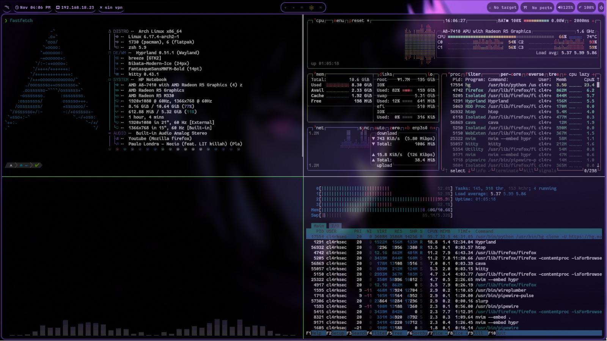

# ＨＹＰＲＬＡＮＤ  ＫＡＬＩ
*Este proyecto contiene mi entorno grafico completo basado en **HYPRLAND** para Kali Linux - Arch Linux*




## Menu


## Wallpapers


## Instalacion 
```bash
- git clone https://github.com/espinalclark/Hyprland-Kali.git
- cd Hyprland-Kali
- chmod +x install.sh
- ./install.sh
```
###############
